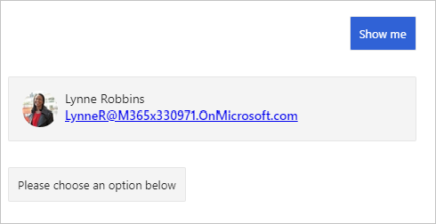

<!-- markdownlint-disable MD002 MD041 -->

<span data-ttu-id="a7683-101">Dans cette section, vous allez utiliser le kit de développement logiciel (SDK) Microsoft Graph pour obtenir l’utilisateur connecté.</span><span class="sxs-lookup"><span data-stu-id="a7683-101">In this section you'll use the Microsoft Graph SDK to get the logged-in user.</span></span>

## <a name="create-a-graph-service"></a><span data-ttu-id="a7683-102">Créer un service Graph</span><span class="sxs-lookup"><span data-stu-id="a7683-102">Create a Graph service</span></span>

<span data-ttu-id="a7683-103">Commencez par implémenter un service que le bot peut utiliser pour obtenir une **GraphServiceClient** du kit de développement logiciel (SDK) de Microsoft Graph, puis rendez ce service disponible pour le bot via l’injection de dépendance.</span><span class="sxs-lookup"><span data-stu-id="a7683-103">Start by implementing a service that the bot can use to get a **GraphServiceClient** from the Microsoft Graph SDK, then making that service available to the bot via dependency injection.</span></span>

1. <span data-ttu-id="a7683-104">Créez un répertoire dans la racine du projet nommé **Graph**.</span><span class="sxs-lookup"><span data-stu-id="a7683-104">Create a new directory in the root of the project named **Graph**.</span></span> <span data-ttu-id="a7683-105">Créez un fichier dans le répertoire **./Graph** nommé **IGraphClientService.cs** et ajoutez le code suivant.</span><span class="sxs-lookup"><span data-stu-id="a7683-105">Create a new file in the **./Graph** directory named **IGraphClientService.cs** and add the following code.</span></span>

    :::code language="csharp" source="../demo/GraphCalendarBot/Graph/IGraphClientService.cs" id="IGraphClientServiceSnippet":::

1. <span data-ttu-id="a7683-106">Créez un fichier dans le répertoire **./Graph** nommé **GraphClientService.cs** et ajoutez le code suivant.</span><span class="sxs-lookup"><span data-stu-id="a7683-106">Create a new file in the **./Graph** directory named **GraphClientService.cs** and add the following code.</span></span>

    :::code language="csharp" source="../demo/GraphCalendarBot/Graph/GraphClientService.cs" id="GraphClientServiceSnippet":::

1. <span data-ttu-id="a7683-107">Ouvrez **./Startup.cs** et ajoutez le code suivant à la fin de la `ConfigureServices` fonction.</span><span class="sxs-lookup"><span data-stu-id="a7683-107">Open **./Startup.cs** and add the following code to the end of the `ConfigureServices` function.</span></span>

    :::code language="csharp" source="../demo/GraphCalendarBot/Startup.cs" id="AddGraphServiceSnippet":::

1. <span data-ttu-id="a7683-108">Ouvrez **./dialogs/MainDialog.cs**.</span><span class="sxs-lookup"><span data-stu-id="a7683-108">Open **./Dialogs/MainDialog.cs**.</span></span> <span data-ttu-id="a7683-109">Ajoutez les `using` instructions suivantes en haut du fichier.</span><span class="sxs-lookup"><span data-stu-id="a7683-109">Add the following `using` statements to the top of the file.</span></span>

    ```csharp
    using System;
    using System.IO;
    using CalendarBot.Graph;
    using AdaptiveCards;
    using Microsoft.Graph;
    ```

1. <span data-ttu-id="a7683-110">Ajoutez la propriété suivante à la classe **MainDialog** .</span><span class="sxs-lookup"><span data-stu-id="a7683-110">Add the following property to the **MainDialog** class.</span></span>

    ```csharp
    private readonly IGraphClientService _graphClientService;
    ```

1. <span data-ttu-id="a7683-111">Recherchez le constructeur de la classe **MainDialog** et mettez à jour sa signature afin de prendre un paramètre **IGraphServiceClient** .</span><span class="sxs-lookup"><span data-stu-id="a7683-111">Locate the constructor for the **MainDialog** class and update its signature to take an **IGraphServiceClient** parameter.</span></span>

    :::code language="csharp" source="../demo/GraphCalendarBot/Dialogs/MainDialog.cs" id="ConstructorSignatureSnippet" highlight="4":::

1. <span data-ttu-id="a7683-112">Ajoutez le code suivant au constructeur.</span><span class="sxs-lookup"><span data-stu-id="a7683-112">Add the following code to the constructor.</span></span>

    ```csharp
    _graphClientService = graphClientService;
    ```

## <a name="get-the-logged-on-user"></a><span data-ttu-id="a7683-113">Obtenir l’utilisateur connecté</span><span class="sxs-lookup"><span data-stu-id="a7683-113">Get the logged on user</span></span>

<span data-ttu-id="a7683-114">Dans cette section, vous allez utiliser Microsoft Graph pour obtenir le nom, l’adresse de messagerie et la photo de l’utilisateur.</span><span class="sxs-lookup"><span data-stu-id="a7683-114">In this section you'll use the Microsoft Graph to get the user's name, email address, and photo.</span></span> <span data-ttu-id="a7683-115">Ensuite, vous allez créer une carte adaptative pour afficher les informations.</span><span class="sxs-lookup"><span data-stu-id="a7683-115">Then you'll create an Adaptive Card to show the information.</span></span>

1. <span data-ttu-id="a7683-116">Créez un fichier à la racine du projet nommé **CardHelper.cs**.</span><span class="sxs-lookup"><span data-stu-id="a7683-116">Create a new file in the root of the project named **CardHelper.cs**.</span></span> <span data-ttu-id="a7683-117">Ajoutez le code suivant au fichier.</span><span class="sxs-lookup"><span data-stu-id="a7683-117">Add the following code to the file.</span></span>

    ```csharp
    using AdaptiveCards;
    using Microsoft.Graph;
    using System;
    using System.IO;

    namespace CalendarBot
    {
        public class CardHelper
        {
            public static AdaptiveCard GetUserCard(User user, Stream photo)
            {
              // Create an Adaptive Card to display the user
                // See https://adaptivecards.io/designer/ for possibilities
                var userCard = new AdaptiveCard("1.2");

                var columns = new AdaptiveColumnSet();
                userCard.Body.Add(columns);

                var userPhotoColumn = new AdaptiveColumn { Width = AdaptiveColumnWidth.Auto };
                columns.Columns.Add(userPhotoColumn);

                userPhotoColumn.Items.Add(new AdaptiveImage {
                    Style = AdaptiveImageStyle.Person,
                    Size = AdaptiveImageSize.Small,
                    Url = GetDataUriFromPhoto(photo)
                });

                var userInfoColumn = new AdaptiveColumn {Width = AdaptiveColumnWidth.Stretch };
                columns.Columns.Add(userInfoColumn);

                userInfoColumn.Items.Add(new AdaptiveTextBlock {
                    Weight = AdaptiveTextWeight.Bolder,
                    Wrap = true,
                    Text = user.DisplayName
                });

                userInfoColumn.Items.Add(new AdaptiveTextBlock {
                    Spacing = AdaptiveSpacing.None,
                    IsSubtle = true,
                    Wrap = true,
                    Text = user.Mail ?? user.UserPrincipalName
                });

                return userCard;
            }

            private static Uri GetDataUriFromPhoto(Stream photo)
            {
                // Copy to a MemoryStream to get access to bytes
                var photoStream = new MemoryStream();
                photo.CopyTo(photoStream);

                var photoBytes = photoStream.ToArray();

                return new Uri($"data:image/png;base64,{Convert.ToBase64String(photoBytes)}");
            }
        }
    }
    ```

    <span data-ttu-id="a7683-118">Ce code utilise le package NuGet **AdaptiveCard** pour créer une carte adaptative permettant d’afficher l’utilisateur.</span><span class="sxs-lookup"><span data-stu-id="a7683-118">This code uses the **AdaptiveCard** NuGet package to build an Adaptive Card to display the user.</span></span>

1. <span data-ttu-id="a7683-119">Ajoutez la fonction suivante à la classe **MainDialog** .</span><span class="sxs-lookup"><span data-stu-id="a7683-119">Add the following function to the **MainDialog** class.</span></span>

    :::code language="csharp" source="../demo/GraphCalendarBot/Dialogs/MainDialog.cs" id="DisplayLoggedInUserSnippet":::

    <span data-ttu-id="a7683-120">Examinez ce que fait ce code.</span><span class="sxs-lookup"><span data-stu-id="a7683-120">Consider what this code does.</span></span>

    - <span data-ttu-id="a7683-121">Il utilise le **graphClient** pour [obtenir l’utilisateur connecté](https://docs.microsoft.com/graph/api/user-get?view=graph-rest-1.0).</span><span class="sxs-lookup"><span data-stu-id="a7683-121">It uses the **graphClient** to [get the logged-in user](https://docs.microsoft.com/graph/api/user-get?view=graph-rest-1.0).</span></span>
        - <span data-ttu-id="a7683-122">Il utilise la `Select` méthode pour limiter les champs qui sont renvoyés.</span><span class="sxs-lookup"><span data-stu-id="a7683-122">It uses the `Select` method to limit which fields are returned.</span></span>
    - <span data-ttu-id="a7683-123">Il utilise le **graphClient** pour [obtenir la photo](https://docs.microsoft.com/graph/api/profilephoto-get?view=graph-rest-1.0)de l’utilisateur, en demandant la plus petite taille prise en charge de 48 x 48 pixels.</span><span class="sxs-lookup"><span data-stu-id="a7683-123">It uses the **graphClient** to [get the user's photo](https://docs.microsoft.com/graph/api/profilephoto-get?view=graph-rest-1.0), requesting the smallest supported size of 48x48 pixels.</span></span>
    - <span data-ttu-id="a7683-124">Il utilise la classe **CardHelper** pour construire une carte adaptative et l’envoyer sous forme de pièce jointe.</span><span class="sxs-lookup"><span data-stu-id="a7683-124">It uses the **CardHelper** class to construct an Adaptive Card and sends the card as an attachment.</span></span>

1. <span data-ttu-id="a7683-125">Remplacez le code à l’intérieur du `else if (command.StartsWith("show me"))` bloc `ProcessStepAsync` par ce qui suit.</span><span class="sxs-lookup"><span data-stu-id="a7683-125">Replace the code inside the `else if (command.StartsWith("show me"))` block in `ProcessStepAsync` with the following.</span></span>

    :::code language="csharp" source="../demo/GraphCalendarBot/Dialogs/MainDialog.cs" id="ShowMeSnippet" highlight="3":::

1. <span data-ttu-id="a7683-126">Enregistrez toutes vos modifications et redémarrez le robot.</span><span class="sxs-lookup"><span data-stu-id="a7683-126">Save all of your changes and restart the bot.</span></span>

1. <span data-ttu-id="a7683-127">Utilisez l’émulateur de l’infrastructure bot pour vous connecter au bot et vous connecter.</span><span class="sxs-lookup"><span data-stu-id="a7683-127">Use the Bot Framework Emulator to connect to the bot and log in.</span></span> <span data-ttu-id="a7683-128">Sélectionnez le bouton **Afficher** pour afficher l’utilisateur connecté.</span><span class="sxs-lookup"><span data-stu-id="a7683-128">Select the **Show me** button to display the logged-on user.</span></span>

    
